# Chain-of-Zoom 项目分析报告

## 1. 项目概述

Chain-of-Zoom 是一个创新的单图像超分辨率(SISR)项目，通过自回归缩放和偏好对齐来实现极限分辨率提升。项目的主要目标是解决现有超分辨率模型在以下方面的局限性：

1. 当模型应用于超出训练范围的放大倍数时产生的模糊和伪影问题
2. 需要为更高分辨率重新训练模型带来的高计算成本和低效率问题

## 2. 核心算法解析

### 2.1 自回归缩放链算法

Chain-of-Zoom的核心思想是将极限超分辨率任务分解为一系列较小的放大步骤，每个步骤都重复使用同一个基础SR模型。这个过程可以用以下数学公式表示：

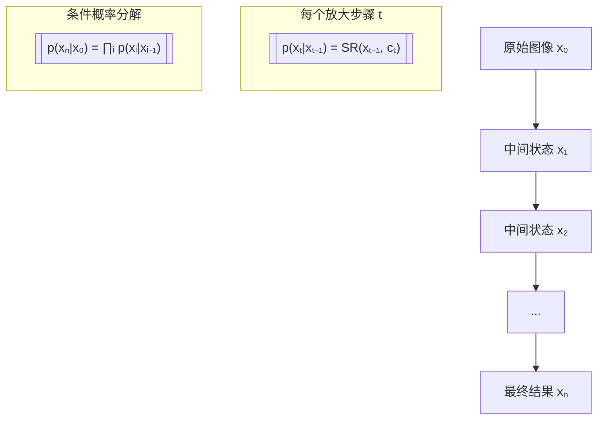

### 2.2 多尺度感知提示生成

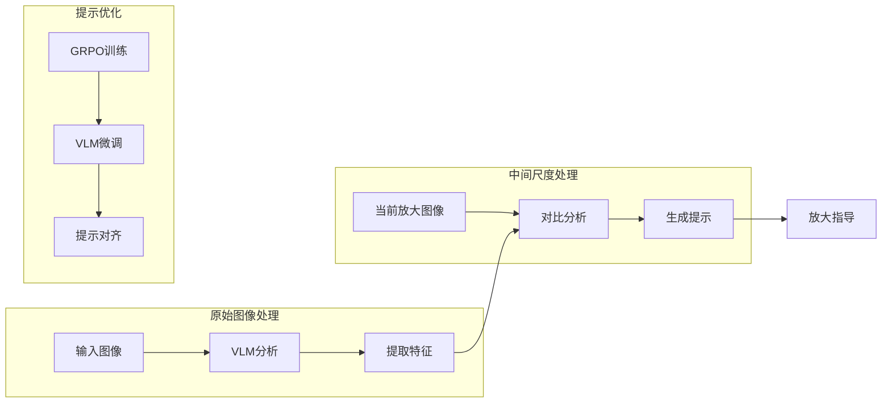

### 2.3 偏好对齐机制

通过GRPO (GPT Reward Preference Optimization) 实现提示生成的偏好对齐：

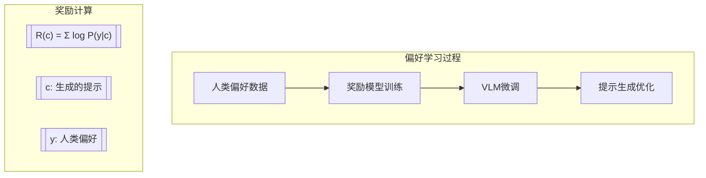

### 2.4 放大策略比较

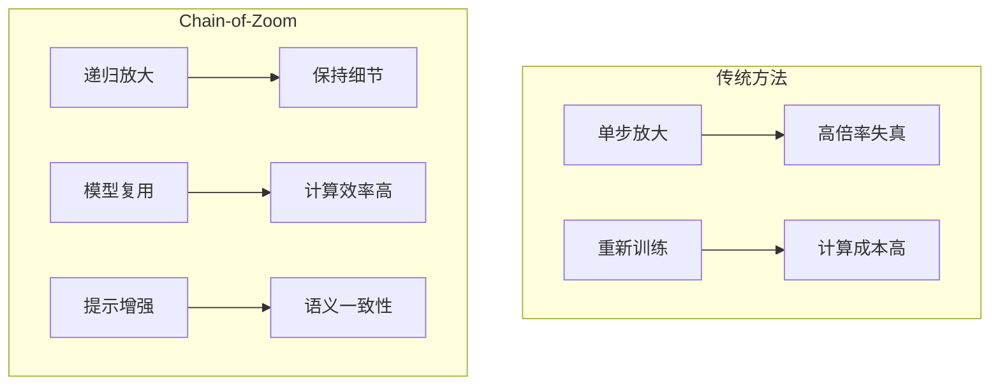

## 3. 技术架构

### 3.1 系统架构图

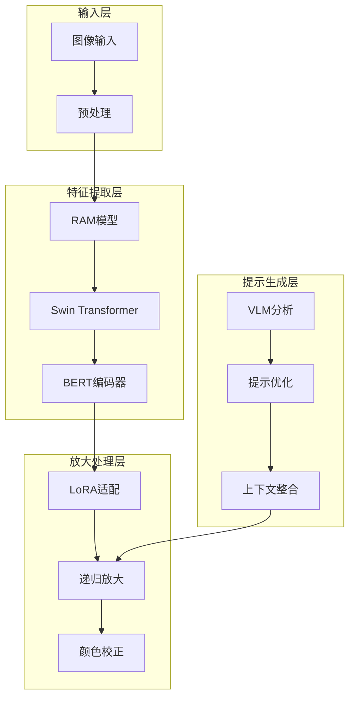

### 3.2 处理流程详解

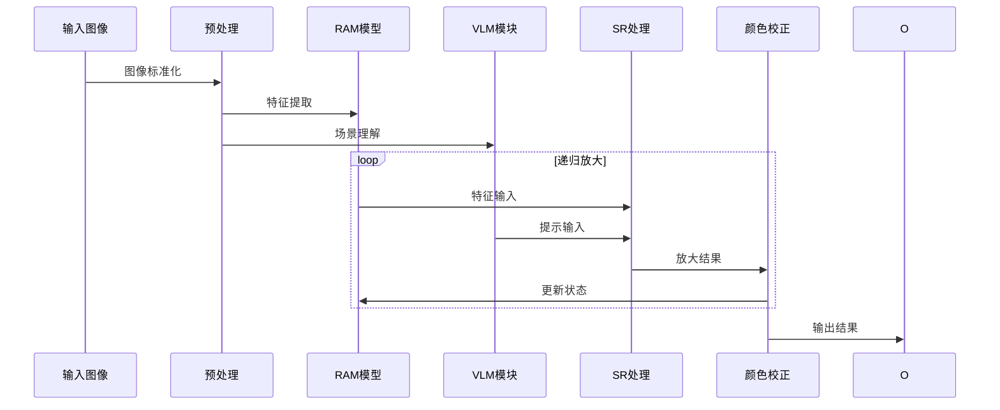

## 4. 关键技术创新

### 4.1 多尺度状态分解

将高倍率放大任务分解为多个较小的放大步骤，每个步骤的数学表达：

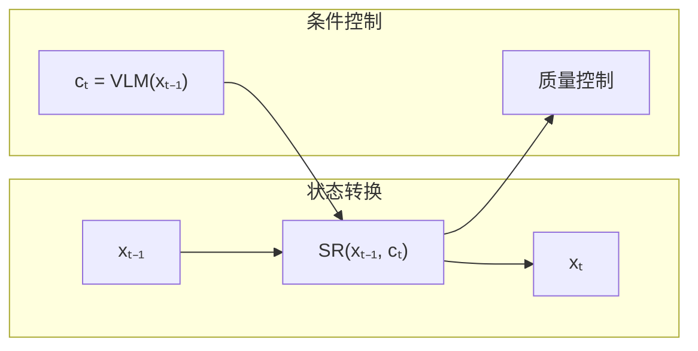

### 4.2 LoRA适配策略

低秩适应的核心实现原理：

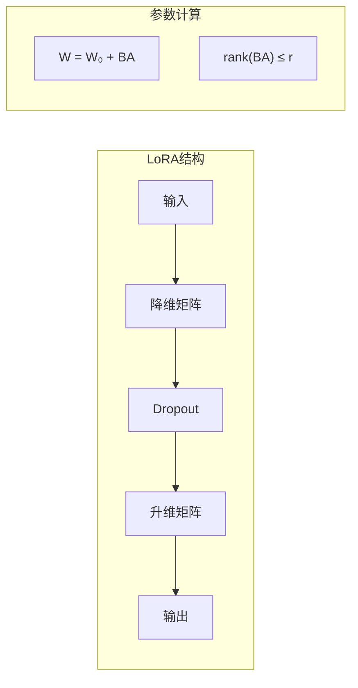

### 4.3 颜色校正机制

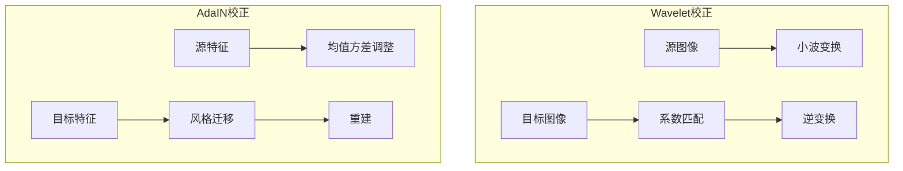

## 5. 性能分析

### 5.1 计算复杂度对比

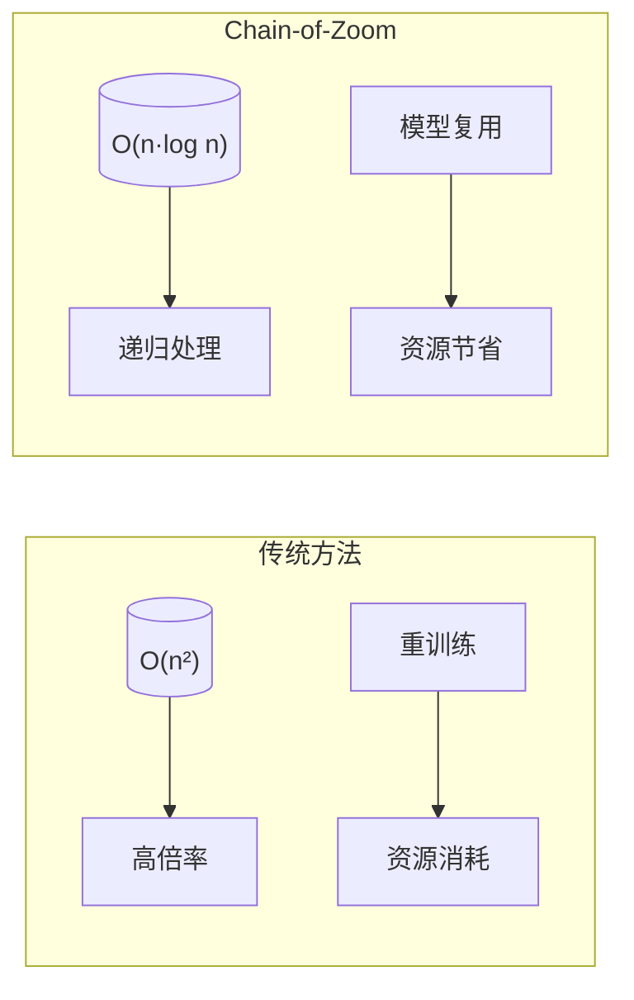

### 5.2 内存优化策略

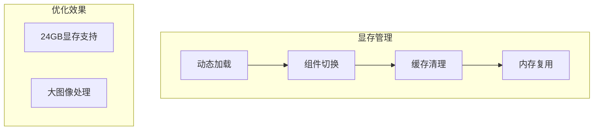

## 6. 应用场景与效果

### 6.1 应用场景分析

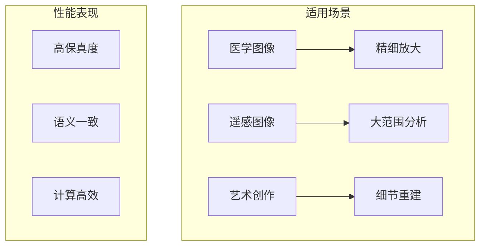

### 6.2 效果对比

1. **细节保持能力**
   - 传统方法：高倍率下细节丢失严重
   - Chain-of-Zoom：通过递归处理保持细节完整性

2. **语义一致性**
   - 传统方法：缺乏语义理解
   - Chain-of-Zoom：VLM提供的文本提示确保语义连贯

3. **计算效率**
   - 传统方法：需要针对不同倍率重新训练
   - Chain-of-Zoom：单一模型支持多种放大倍率

## 7. 总结与展望

Chain-of-Zoom通过创新的技术方案解决了单图像超分辨率领域的关键问题：

1. **技术创新**
   - 自回归缩放链分解复杂任务
   - 多尺度感知提示保持语义
   - 偏好对齐优化生成质量

2. **实践价值**
   - 降低计算资源需求
   - 提高放大质量
   - 扩展应用场景

3. **未来展望**
   - 进一步优化内存使用
   - 增强多GPU支持
   - 拓展应用领域

通过详细的算法解析和图形化展示，我们可以更好地理解Chain-of-Zoom的技术创新和实现原理，这为后续的开发和优化提供了清晰的指导方向。
