# Chain-of-Zoom Project Analysis Report

## 1. Project Overview

Chain-of-Zoom is an innovative Single Image Super-Resolution (SISR) project that achieves extreme resolution enhancement through autoregressive scaling and preference alignment. The project aims to address key limitations in existing super-resolution models:

1. Blur and artifact issues when models are pushed beyond their training magnification range
2. High computational costs and inefficiency of retraining models for higher resolutions

## 2. Core Algorithm Analysis

### 2.1 Autoregressive Scaling Chain Algorithm

Chain-of-Zoom's core concept is decomposing extreme super-resolution tasks into a series of smaller magnification steps, each reusing the same base SR model. This process can be represented by the following mathematical formulas:

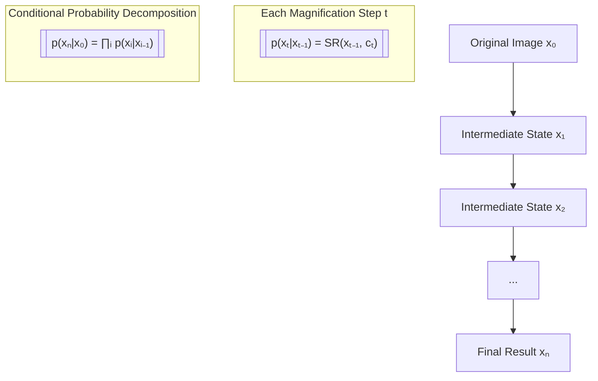

### 2.2 Multi-scale Aware Prompt Generation

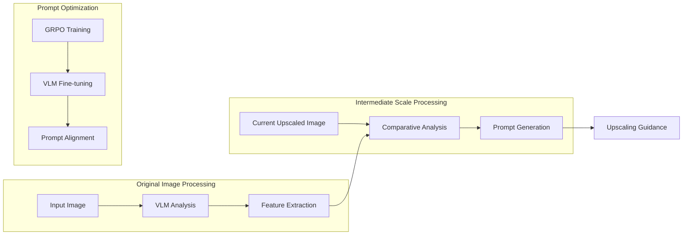

### 2.3 Preference Alignment Mechanism

Implementation of prompt generation preference alignment through GRPO (GPT Reward Preference Optimization):

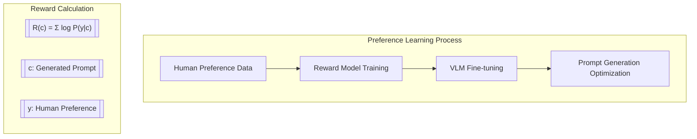

### 2.4 Upscaling Strategy Comparison

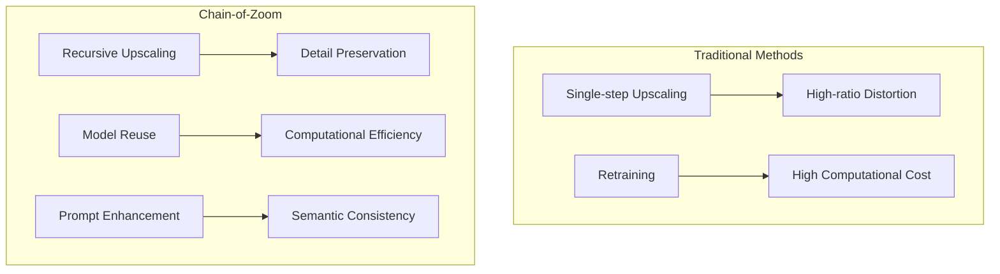

## 3. Technical Architecture

### 3.1 System Architecture Diagram

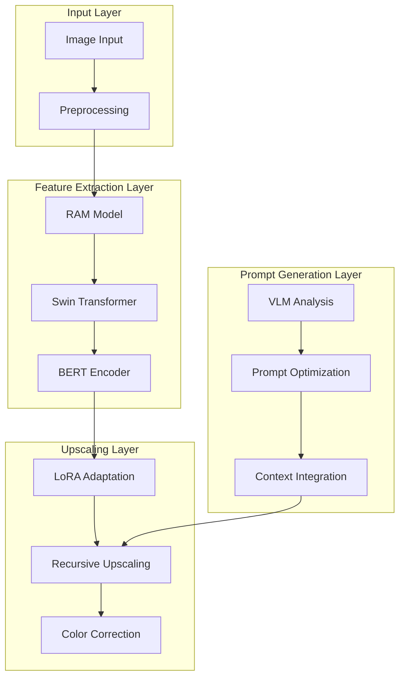

### 3.2 Processing Flow Details

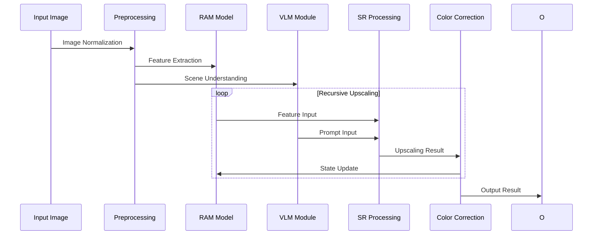

## 4. Key Technical Innovations

### 4.1 Multi-scale State Decomposition

Decomposing high-ratio upscaling tasks into multiple smaller steps, with mathematical expression for each step:

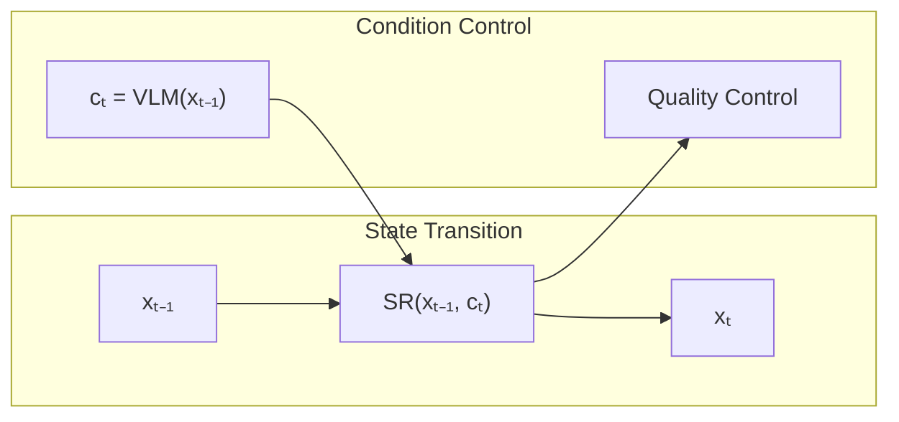

### 4.2 LoRA Adaptation Strategy

Core implementation principle of Low-Rank Adaptation:

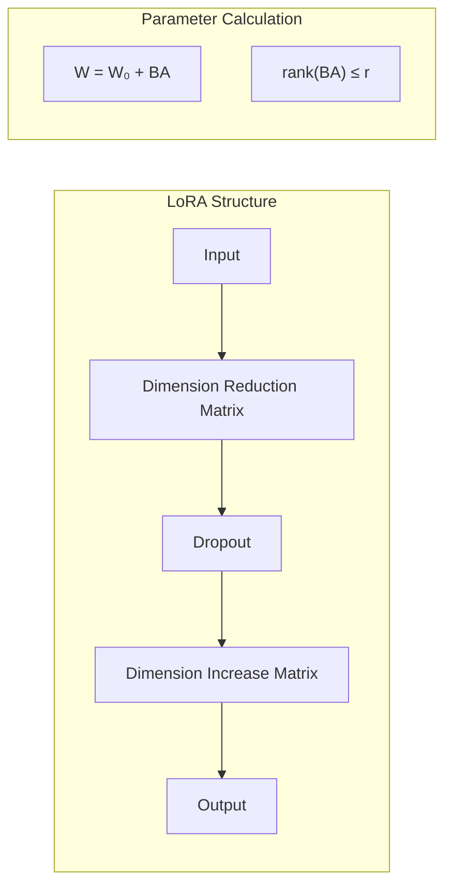

### 4.3 Color Correction Mechanism

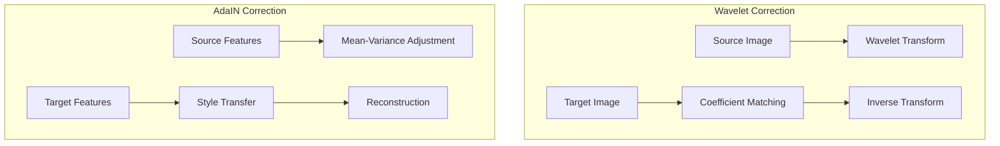

## 5. Performance Analysis

### 5.1 Computational Complexity Comparison

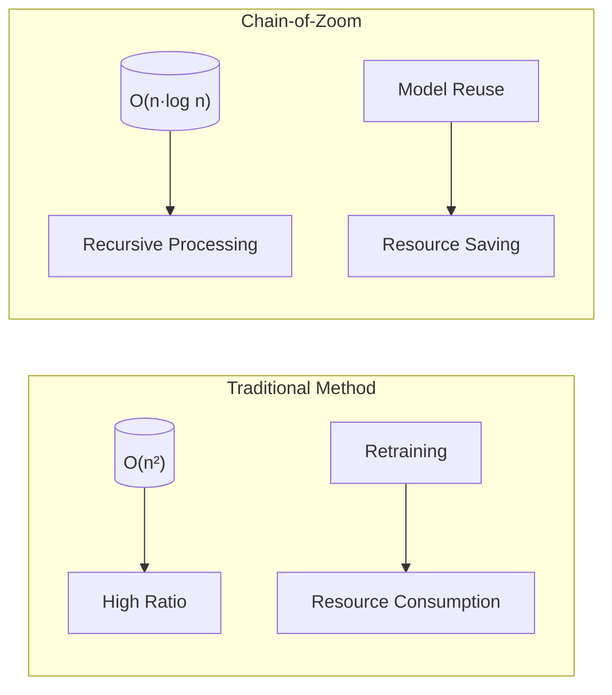

### 5.2 Memory Optimization Strategy

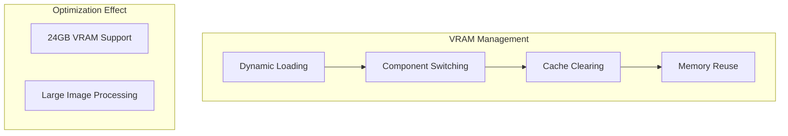

## 6. Application Scenarios and Effects

### 6.1 Application Scenario Analysis

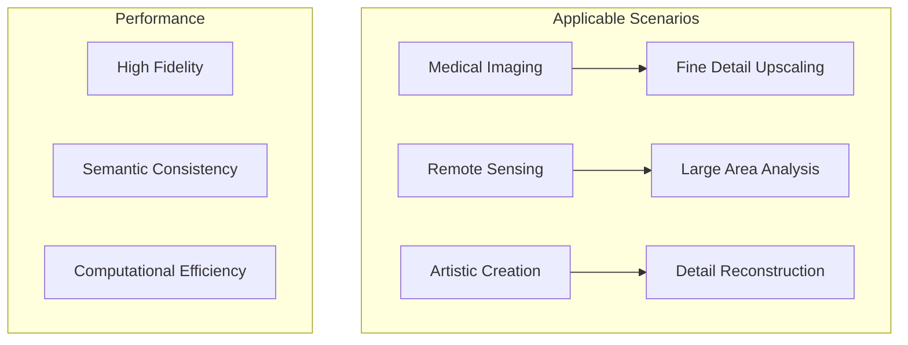

### 6.2 Effect Comparison

1. **Detail Preservation Capability**
   - Traditional Methods: Severe detail loss at high ratios
   - Chain-of-Zoom: Detail integrity maintained through recursive processing

2. **Semantic Consistency**
   - Traditional Methods: Lack of semantic understanding
   - Chain-of-Zoom: Semantic coherence ensured by VLM text prompts

3. **Computational Efficiency**
   - Traditional Methods: Requires retraining for different ratios
   - Chain-of-Zoom: Single model supports multiple upscaling ratios

## 7. Conclusion and Future Prospects

Chain-of-Zoom solves key challenges in the single image super-resolution field through innovative technical solutions:

1. **Technical Innovation**
   - Autoregressive scaling chain decomposition of complex tasks
   - Multi-scale aware prompts maintain semantics
   - Preference alignment optimizes generation quality

2. **Practical Value**
   - Reduced computational resource requirements
   - Improved upscaling quality
   - Extended application scenarios

3. **Future Outlook**
   - Further memory usage optimization
   - Enhanced multi-GPU support
   - Expanded application domains

Through detailed algorithm analysis and graphical representation, we can better understand Chain-of-Zoom's technical innovations and implementation principles, providing clear guidance for subsequent development and optimization.
